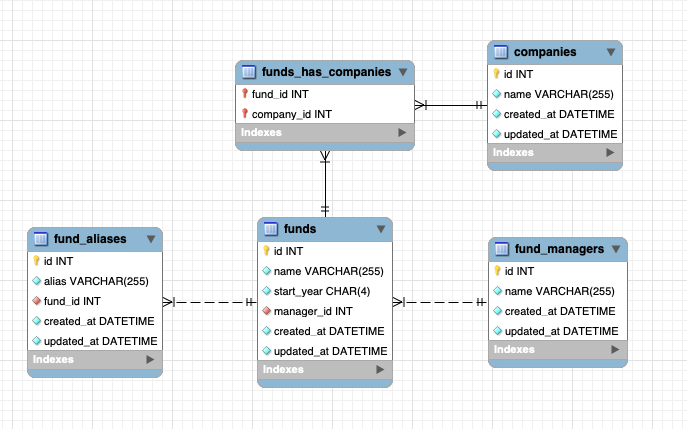

# Canoe Test

## Gettings Started
It's need to install in your computer:
`Docker: 24.0.0+`

Execute this commands to start the application:
```bash
// Create the .env file
cp .env.example .env
// Start all containers docker
make up
// Enter in container
make bash
// Generate the key
php artisan key:generate
// It's everything!
// You can access the api in: http://localhost:8040/
```
## Framework
- [Laravel](https://laravel.com/)
## Database
- MySQL 8.0
- Redis 6.2

### ER Diagram


### Migrations
```bash
// Create migrations (First time)
php artisan migrate --seed
// Drop/Create migrations with seeds
php artisan migrate:fresh --seed
// Install database without datas
php artisan migrate:fresh
```

## API Docs
There is a postman collection in the root of the project called `docs/canoe.postman_collection.json`

### Get all funds
```bash
curl --location --request GET 'http://localhost:8040/api/funds'
```
### Get all funds with filters
```bash
curl --location --request GET 'http://localhost:8040/api/funds?search=name%3ABergstrom%3Bstart_year%3A1987%3Bmanager.name%3AParisian'
```

### Get fund by id
```bash
curl --location --request GET 'http://localhost:8040/api/funds/1'
```

### Create fund
```bash
curl --location --request POST 'http://localhost:8040/api/funds' \
--header 'Content-Type: application/json' \
--data '{
    "name": "Fund name",
    "start_year": "2023",
    "manager_id": 1
}'
```

The listener will write a log message in the file `storage/logs/laravel-d-m-Y.log` when receive a event FundDuplicateWarning from the event dispatcher.

### Update fund
```bash
curl --location --request PUT 'http://localhost:8040/api/funds/1' \
--header 'Content-Type: application/json' \
--data '{
    "name": "Fund name",
    "start_year": "2023",
    "manager_id": 1
}'
```

### Delete fund
```bash
curl --location --request DELETE 'http://localhost:8040/api/funds/1'
```

## Tests
```bash
// Run all tests
make bash
php artisan test
```

## Scalability considerations:
### How will your application work as the data set grows increasingly larger?
Will work fine, but we can improve the performance with the following actions:
1. Optimize the database queries with proper indexing
2. Use a cache system like Redis to store the data and avoid database queries
3. Use a database cluster to distribute the database queries between multiple instances

### How will your application work as the # of concurrent users grows increasingly larger?
Will work fine, but we can improve the performance with the following actions:
1. We can use a load balancer to distribute the requests between multiple instances
2. We can use an APM tool to monitor the application performance and identify bottlenecks
